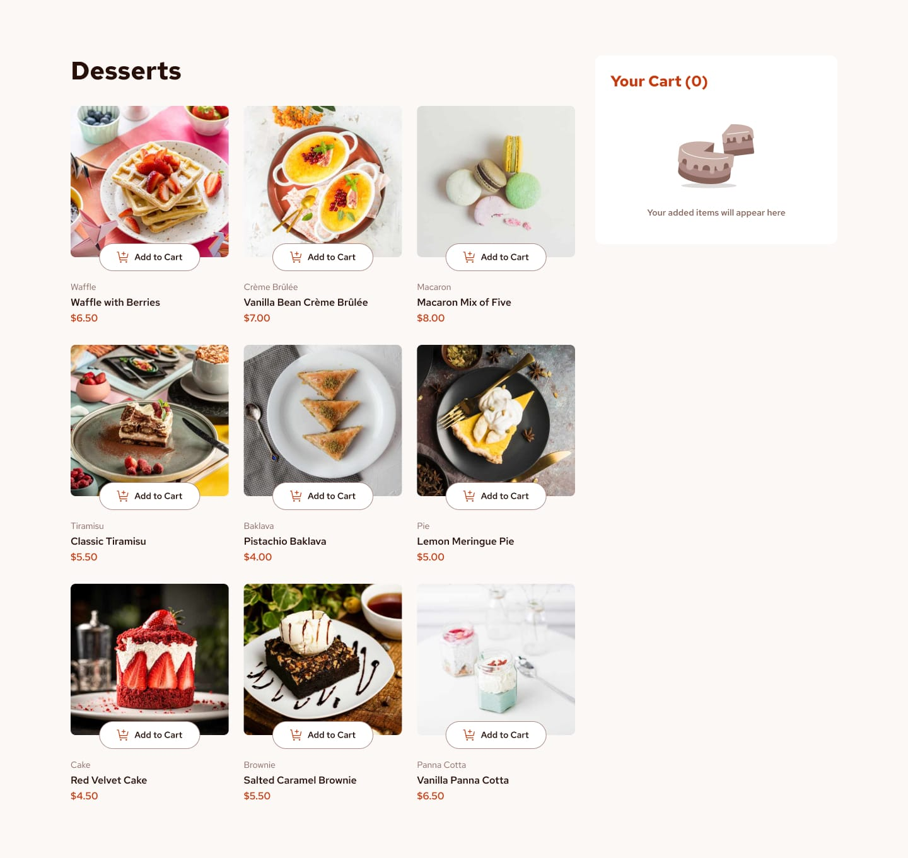
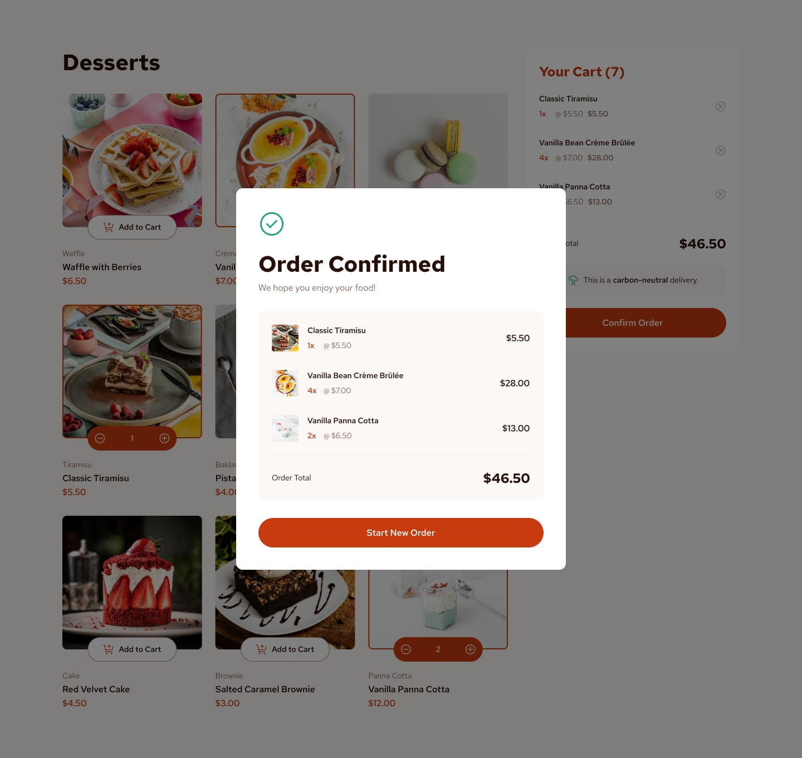
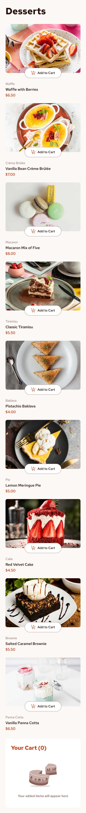
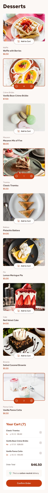
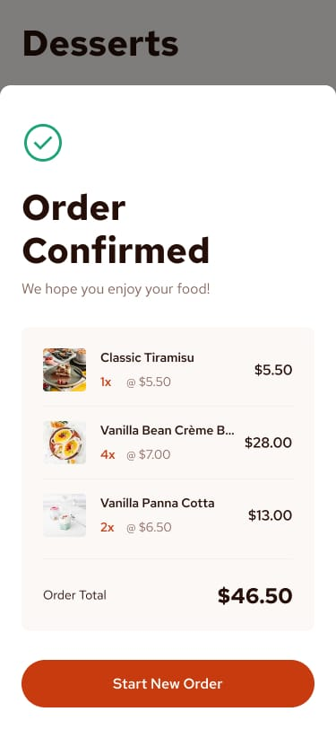

# Frontend Mentor - Product List with Cart Solution

This is my solution to the **Product List with Cart** challenge on Frontend Mentor. This project focuses on building a modern, fully responsive dessert product listing and shopping cart interface that adapts seamlessly across desktop, tablet, and mobile devices.

The challenge provided an excellent opportunity to practice React component architecture, reusable components, React Hooks, state management, props, conditional rendering, dynamic list rendering, responsive layouts with Tailwind CSS v4, Flexbox, interactive UI states, animations with Motion, and deploying a production-ready application using Vite and GitHub Pages.

---

## Table of contents

* [Overview](#overview)
* [The challenge](#the-challenge)
* [Design](#design)
* [Links](#links)
* [My process](#my-process)
* [Built with](#built-with)
* [What I learned](#what-i-learned)

---

## Overview

This project is a responsive dessert product listing application that allows users to browse different desserts, add products to their shopping cart, adjust quantities, remove products, and confirm their order.

The interface was built following a mobile-first approach using React and Tailwind CSS v4. The layout adapts across mobile, tablet, and desktop screen sizes while maintaining a consistent visual hierarchy and user experience.

The application is organized into reusable React components grouped by functionality, making the project easier to maintain and extend.

The application also includes animated transitions for the shopping cart and order confirmation modal using Motion.

---

## The challenge

Users should be able to:

* View the optimal layout depending on their device's screen size.
* View a list of available desserts.
* Add desserts to the shopping cart.
* Increase the quantity of products in the cart.
* Decrease the quantity of products in the cart.
* Remove products from the shopping cart.
* View the total number of products in the cart.
* View the total price of the order.
* View an empty cart state when no products have been added.
* View a carbon-neutral delivery message.
* Confirm an order.
* View an order confirmation modal containing the selected products.
* Start a new order and reset the shopping cart.
* Experience responsive layouts across mobile, tablet, and desktop devices.
* Interact with UI elements using reusable React components.
* Experience subtle animations when the cart and order confirmation states change.

---

## Design

### Desktop Design


### Active states


### Desktop design selected


### Desktop Order Confirmation


### Mobile Design


### Mobile Design selected


### Order Confirmation

---

## Links

* Solution URL: [GitHub Repository](https://github.com/mlopezl/product-list-with-card)
* Live Site URL: [Live Demo](https://mlopezl.github.io/product-list-with-card/)

---

## My process

* Structured the application using reusable React functional components.

* Organized the project by feature-based component folders, including:

  * Cards
  * Cart
  * Order

* Followed a mobile-first workflow to ensure a responsive experience across different screen sizes.

* Built responsive layouts using Flexbox and Tailwind CSS utility classes.

* Implemented responsive breakpoints.

* Created reusable components for product cards, cart items, buttons, order information, and the order confirmation modal.

* Used React props to pass product data, cart information, callback functions, and calculated values between parent and child components.

* Managed the shopping cart state using React's `useState` Hook.

* Created a `cart` state array to store selected desserts and their quantities.

* Implemented functionality to add products to the cart.

* Checked whether a product already exists in the cart before adding it.

* Increased the product quantity when an existing product is added again.

* Implemented functionality to decrease the quantity of products in the cart.

* Automatically removed a product from the cart when its quantity reaches one and the user decreases it.

* Implemented functionality to completely remove products from the shopping cart.

* Calculated the order total dynamically using the `.reduce()` method.

* Rendered product cards and cart items dynamically using the `.map()` method.

* Used unique `key` props when rendering dynamic lists.

* Implemented conditional rendering to display different cart states depending on whether products have been added.

* Created an empty cart interface that is displayed when the cart contains no products.

* Created a filled cart interface that displays:

  * Selected products
  * Product quantities
  * Individual product prices
  * Total order price
  * Carbon-neutral delivery message
  * Order confirmation button

* Created a separate order confirmation component to display the completed order.

* Passed the cart data and calculated total to the order confirmation component using React props.

* Implemented an order completion state using `useState`.

* Displayed the order confirmation modal conditionally when an order is completed.

* Used `AnimatePresence` from Motion to handle mounting and unmounting animations.

* Added subtle opacity and scale animations to the order confirmation modal.

* Added a background overlay when the order confirmation modal is displayed.

* Used the `useEffect` Hook to automatically scroll the page to the top when the order confirmation state changes.

* Implemented a "Start New Order" action that resets the order confirmation state and clears the shopping cart.

* Used responsive image sources provided by the project data for different screen sizes.

* Stored the dessert information in a separate `data.json` file, keeping product data separated from the React components.

* Used Tailwind CSS v4 utility classes to create the responsive layout and visual styling.

* Used custom Tailwind utility classes for colors, spacing, typography, borders, and shadows.

* Used SVG assets for interactive interface elements such as cart and quantity controls.

* Built and optimized the project using Vite.

* Used PNPM as the package manager.

* Generated a production build with:

```bash
pnpm run build
```

* Deployed the production build to GitHub Pages.

---

## Built with

* React
* JSX
* JavaScript (ES6+)
* React Hooks
* `useState`
* `useEffect`
* React Props
* Component Composition
* Tailwind CSS v4
* Flexbox
* Responsive Design Principles
* Mobile-first Workflow
* Semantic HTML
* Conditional Rendering
* Dynamic List Rendering
* Array Methods
* `.map()`
* `.find()`
* `.filter()`
* `.reduce()`
* Event Handling
* State Management
* Shopping Cart Logic
* JSON Data
* Responsive Images
* SVG Assets
* Motion
* `AnimatePresence`
* `motion.div`
* Vite
* PNPM
* ESLint
* GitHub Pages

---

## What I learned

* Building responsive interfaces using React and Tailwind CSS.
* Creating reusable React components with a clear separation of responsibilities.
* Organizing components using a feature-based folder structure.
* Passing data and callback functions between components using props.
* Managing application state with the `useState` Hook.
* Managing arrays of objects inside React state.
* Updating state immutably using the spread operator.
* Adding and updating items inside a shopping cart.
* Using `.find()` to search for existing products.
* Using `.map()` to update specific objects inside an array.
* Using `.filter()` to remove products from an array.
* Using `.reduce()` to calculate the total order price.
* Creating dynamic shopping cart functionality with React state.
* Using conditional rendering to display different UI states.
* Rendering dynamic content from JavaScript arrays.
* Understanding the importance of unique `key` props when rendering lists in React.
* Separating application data from presentation logic using a JSON file.
* Passing calculated values between components using props.
* Building a reusable order confirmation interface.
* Managing modal visibility using React state.
* Creating animations with Motion and `AnimatePresence`.
* Using opacity and scale animations to create subtle UI transitions.
* Using `useEffect` to perform side effects when application state changes.
* Using Tailwind CSS v4 to create responsive layouts and reusable styling patterns.
* Building responsive interfaces for mobile, tablet, and desktop devices.
* Using Vite for React development and production builds.
* Building optimized production bundles with Vite.
* Deploying a React application to GitHub Pages.
